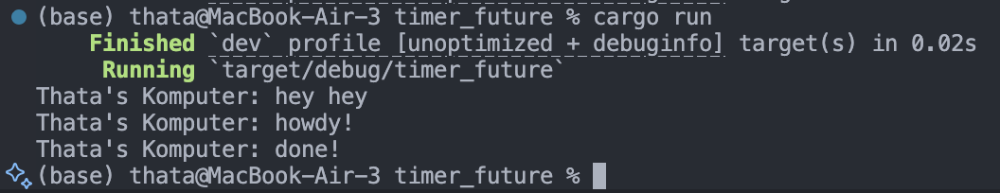
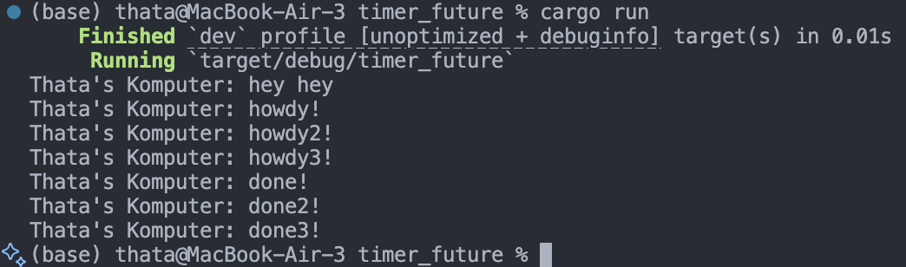
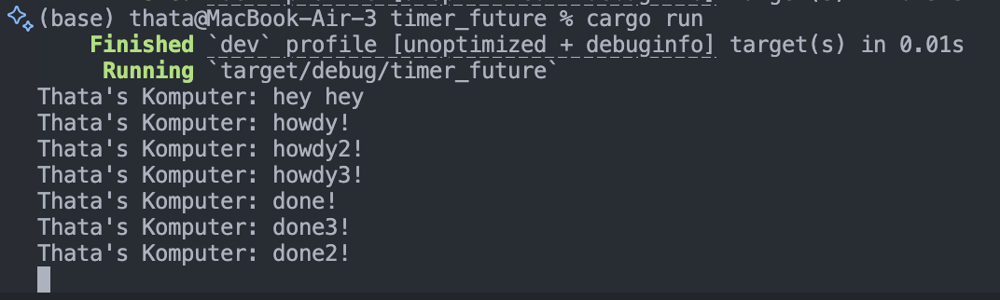

# Advanced Programming Module 10 - Timer
### Athazahra Nabila Ruby - 2306173113

> Understanding how it works
 

An async function runs in the background without blocking the execution of the main thread. This means that the main thread immediately continues to the next line of code without waiting for the async function to finish. Although the async function is called in sequence, it doesn't interrupt the main flow, which is why "hey hey" appears first before "Howdy" and "Done". When the spawner is dropped, it signals that the entire program has finished executing.

> Multiple Spawn and removing drop

 
With drop(spawner):

Without drop(spawner):

With drop(spawner), the program knows when no more tasks will be added, so it waits until all tasks finish before stopping, which ensures that each task completes and their messages are printed in order. Without drop(spawner), the executor keeps running because it thinks more tasks might still come, which causes some tasks to finish in a different order and their messages appear shuffled.  This shows how multiple spawns are handled concurrently and why we need to properly close the spawner to ensure that the task is executed in order.